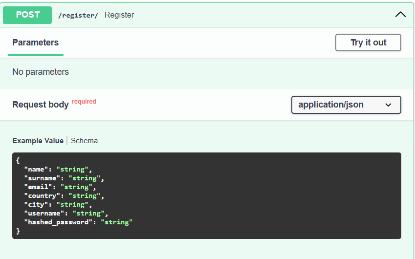
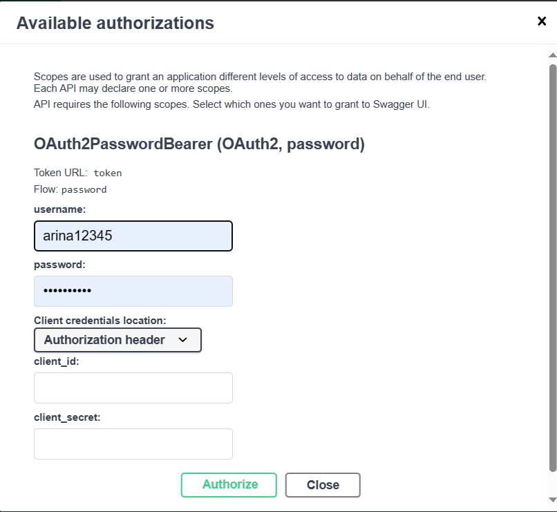

# Авторизация пользователей

>Для того, чтобы авторизоваться, нужны три функции: регистрация, логин (вход) и получение токена

**Функции для авторизации**

```

@app.post("/register/")
def register(user: UsersRegistration, session=Depends(get_session)):
    user = Users.model_validate(user)
    statement = select(Users).where(Users.username == user.username)
    existing_user = session.exec(statement).first()

    if existing_user:
        raise HTTPException(status_code=400, detail="Username already taken")

    user.hashed_password = get_password_hash(user.hashed_password)
    session.add(user)
    session.commit()
    session.refresh(user)
    return {"status": 200, "data": user}


@app.post('/token', response_model=Token)
def login_for_token(
        payload: OAuth2PasswordRequestForm = Depends(),
        session=Depends(get_session)):
    username = authenticate_user(payload.username, payload.password, session)
    if not username:
        raise HTTPException(status_code=401, detail="Incorrect username or password 1")
    access_token = create_access_token(data={"sub": username})
    return {"access_token": access_token, "token_type": "bearer"}


@app.post("/login/")
def login(user: Users, session=Depends(get_session)):
    username = authenticate_user(user.username, user.hashed_password, session)
    if not username:
        raise HTTPException(status_code=401, detail="Incorrect username or password 2")
    access_token = create_access_token(data={"sub": username})
    return {"access_token": access_token, "token_type": "bearer"}

    
```


