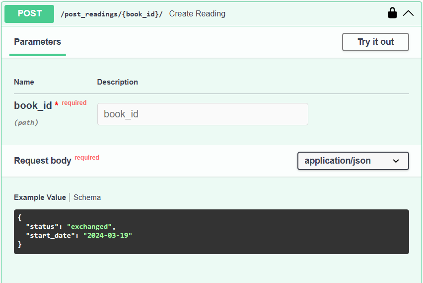
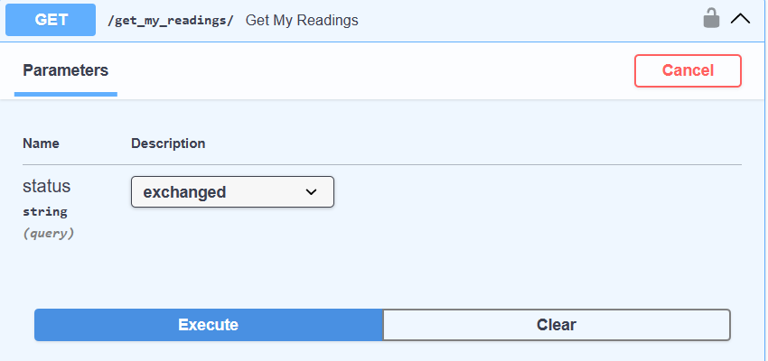
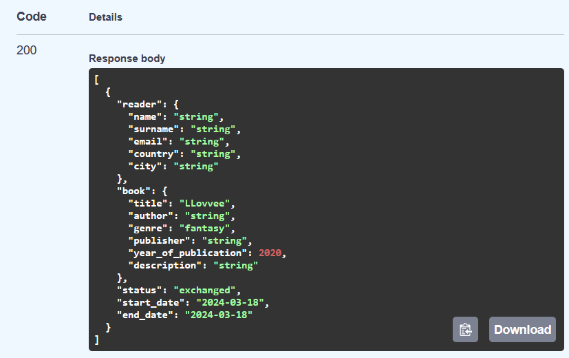
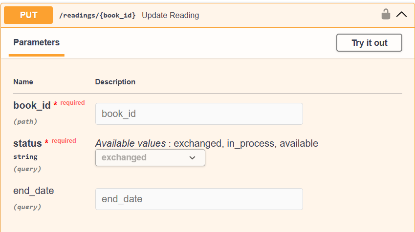
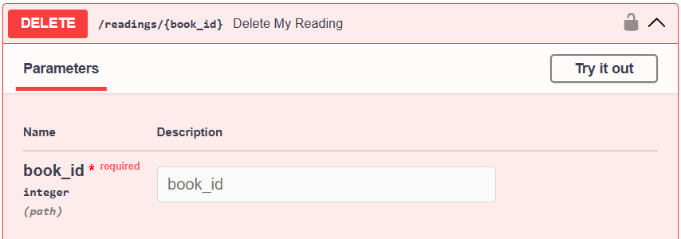

# АПИ методы


**Для работы с пользователями**

```

@app.get("/users/me/", response_model=User)
def read_users_me(current_user: User = Depends(get_current_user), session=Depends(get_session)):
    return session.exec(select(Users).where(Users.id == current_user.id)).first()


@app.delete("/users_me/delete{user_id}")
def user_delete_my_account(user_id: int, current_user: User = Depends(get_current_user), session=Depends(get_session)):
    if user_id != current_user.id:
        raise HTTPException(status_code=401, detail="You can't delete another user")

    statement = select(Users).where(Users.id == user_id)
    results = session.exec(statement)
    user = results.one()
    session.delete(user)
    session.commit()

    return {"status": 201, "message": "deleted"}
    
@app.get("/users/", response_model=List[UserBase])
def read_users(session=Depends(get_session)):
    users = session.exec(select(Users)).all()
    return users


@app.get("/user/{user_id}", response_model=UserGet)
def get_concrete_users(user_id: int,
                       country: str = None,
                       city: str = None,
                       current_user: User = Depends(get_current_user),
                       session=Depends(get_session)):
    statement = select(Users).where(Users.id == user_id)
    if city:
        statement = statement.where(Users.city == city)
    if country:
        statement = statement.where(Users.country == country)
    user = session.exec(statement).first()
    return user
        
```
**Для работы с книгами**

```

@app.post("/post_books/")
def create_book(book: BooksPost, current_user: User = Depends(get_current_user), session=Depends(get_session)):
    book = Books(title=book.title,
                 author=book.author,
                 genre=book.genre,
                 publisher=book.publisher,
                 year_of_publication=book.year_of_publication,
                 description=book.description,
                 owner_id=current_user.id)

    # book = Books.model_validate(book)
    session.add(book)
    session.flush()
    #session.commit()
    #session.refresh(book)
    new_reading = Readings(reader_id=current_user.id,
                           book_id=book.id,
                           status="available",
                           start_date=datetime.date.today(),
                           end_date=None
                           )
    session.add(new_reading)
    session.commit()
    session.refresh(book)

    return book


@app.get("/get_books/", response_model=List[BooksPost])
def read_books(author: Optional[str] = Query(None, title="Author", description="Filter books by author"),
               status: ReadingStatus = None,
               genre: Genres = None,
               session=Depends(get_session)):
    if status:
        statement = (
            select(Books)
                .join(Books.book_read)
                .where(Readings.status == status)
        )
    else:
        statement = select(Books)
    if author:
        statement = statement.where(Books.author.contains(author))
    if genre:
        statement = statement.where(Books.genre == genre)

    books = session.exec(statement).all()
    return books


@app.get("/books/{book_id}", response_model=BooksBase)
def get_concrete_book(book_id: int, current_user: User = Depends(get_current_user), session=Depends(get_session)):
    book = session.exec(select(Books).where(Books.id == book_id)).first()
    return book


@app.get("/books/my_library/", response_model=List[MyBooksBase])
def get_my_books(current_user: User = Depends(get_current_user), session=Depends(get_session)):
    user = session.exec(select(Users).where(Users.username == current_user.username)).first()
    books = session.exec(select(Books).where(Books.owner_id == user.id)).all()
    return books

@app.delete("/books/delete/{book_id}")
def delete_my_book(book_id: int,
                   current_user: User = Depends(get_current_user),
                   session=Depends(get_session)):
    book = session.exec(select(Books).where(Books.id == book_id)).first()
    if book.owner_id != current_user.id:
        raise HTTPException(status_code=401, detail="You can't delete book not yours")

    session.delete(book)
    session.commit()
    return {"status": 201, "message": "deleted"}
            
```
**Для работы с владение книг**

```

@app.post("/post_readings/{book_id}/")
def create_reading(book_id: Optional[int], reading: ReadingPost, current_user: User = Depends(get_current_user),
                   session=Depends(get_session)):

    new_reading = Readings(reader_id=current_user.id,
                           book_id=book_id,
                           status=reading.status,
                           start_date=reading.start_date,
                           end_date=None
                           )
    session.add(new_reading)
    session.commit()
    session.refresh(new_reading)
    return new_reading


'''
@app.get("/get_readings/", response_model=List[ReadingRead])
def get_readings(status: ReadingStatus = None,
                 session=Depends(get_session)):
    statement = select(Readings)
    if status:
        statement = statement.where(Readings.status == status)
    readings = session.exec(statement).all()
    return readings
'''

@app.get("/get_my_readings/", response_model=List[ReadingRead])
def get_my_readings(status: ReadingStatus = None,
                    current_user: User = Depends(get_current_user),
                    session=Depends(get_session)):
    statement = select(Readings).where(Readings.reader_id == current_user.id)
    if status:
        statement = statement.where(Readings.status == status)
    readings = session.exec(statement).all()
    return readings


@app.put("/readings/{book_id}", response_model=ReadingRead)
def update_reading(book_id: Optional[int],
                   status: ReadingStatus,
                   end_date: Optional[date] = None,
                   current_user: User = Depends(get_current_user),
                   session: Session = Depends(get_session)):

    reading = session.exec(select(Readings).where(Readings.reader_id == current_user.id,
                                                  Readings.book_id == book_id)
                           ).first()

    if not reading:
        raise HTTPException(status_code=404, detail="Reading record not found")

    # Update the fields if provided
    if status:
        reading.status = status
    if end_date:
        reading.end_date = end_date

    session.commit()
    session.refresh(reading)

    return reading
    
```
**Для работы с запросами на обмен**

```

@app.post("/post_request/{book_id}/")
def create_request(book_id: Optional[int],
                   request: BaseRequest,
                   current_user: User = Depends(get_current_user),
                   session=Depends(get_session)):

    reading = session.exec(select(Readings).where(Readings.book_id == book_id,
                                                  #Readings.end_date is None,
                                                  Readings.status == "available")).first()

    new_request = Requests(sender_id=current_user.id,
                           receiver_id=reading.reader_id,
                           book_id=book_id,
                           status="sent",
                           conditions=request.conditions,
                           response=None
                           )
    session.add(new_request)
    session.commit()
    session.refresh(new_request)
    return new_request


@app.get("/get_my_requests/", response_model=List[GetRequest])
def get_my_requests(status: RequestStatus = None,
                    sent: bool = True,
                    received: bool = True,
                    current_user: User = Depends(get_current_user),
                    session=Depends(get_session)):

    statement = select(Requests)
    if sent and received:
        statement = statement.where(
                    or_(
                        Requests.sender_id == current_user.id,
                        Requests.receiver_id == current_user.id
                    ))
    elif sent and not received:
        statement = statement.where(Requests.sender_id == current_user.id)
    elif received and not sent:
        statement = statement.where(Requests.receiver_id == current_user.id)
    if status:
        statement = statement.where(Requests.status == status)
    requests = session.exec(statement).all()
    return requests


@app.put("/requests/{book_id}", response_model=UpdateRequest)
def update_response(book_id: Optional[int],
                    status: RequestStatus = "accepted",
                    response: Optional[str] = None,
                    current_user: User = Depends(get_current_user),
                    session: Session = Depends(get_session)):

    request = session.exec(select(Requests).where(Requests.receiver_id == current_user.id,
                                                  Requests.book_id == book_id,
                                                  Requests.status == "sent")
                           ).first()

    if not request:
        raise HTTPException(status_code=404, detail="Request record not found or status isn't 'sent'")

    if status:
        request.status = status
    if response:
        request.response = response

    session.commit()
    session.refresh(response)

    return response
        
```
**Для работы с отзывами**

```

@app.post("/post_review/{book_id}/")
def create_review(book_id: Optional[int],
                  review: ReviewBase,
                  current_user: User = Depends(get_current_user),
                  session=Depends(get_session)):

    if review.rating < 0 or review.rating > 10:
        raise HTTPException(status_code=404, detail="Rating should be in interval [0, 10]")

    new_review = Review(reviewer_id=current_user.id,
                        book_id=book_id,
                        rating=review.rating,
                        comment=review.comment
                        )
    session.add(new_review)
    session.commit()
    session.refresh(new_review)
    return new_review


@app.get("/books/{book_id}/reviews", response_model=List[ReviewsGet])
def read_reviews_on_book(book_id: int, session=Depends(get_session)):
    # book = session.exec(select(Books).where(Books.id == book_id)).first()
    reviews = session.exec(select(Review).where(Review.book_id == book_id))
    return reviews
        
```







